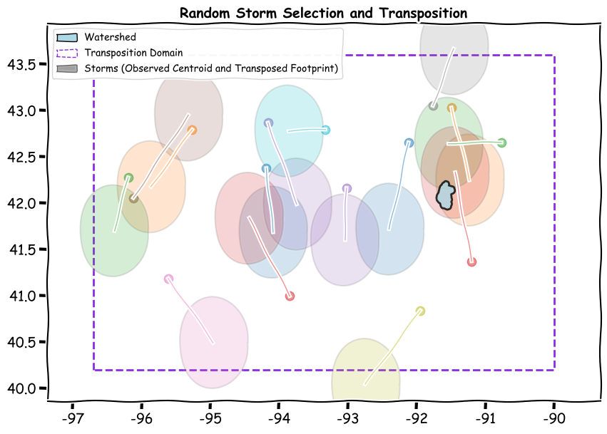

stormhub
========
.. toctree::
   :maxdepth: 2
   :hidden:

   Technical Summary <tech_summary.rst>
   User Guide <user_guide.rst>
   API Reference <modules.rst>
   Changelog <change_log.rst>

.. note::
   This version is tagged as **testing**. Features and APIs are unstable and subject to change.

:code:`stormhub` is an open-source Python library designed to access and process publicly available hydrometeorological data to create catalogs, metadata, and data products for use in hydrologic modeling. This project automates the generation of STAC catalogs from storm and stream gage data, to aid in data development and management for probabilistic studies, including applications of stochastic storm transposition (SST). 
StormHub aims to follow the principles of `FAIR <https://www.nature.com/articles/sdata201618>`_ (Findable, Accessible, Interoperable, and Reusable) data practices, ensuring that all catalogs can be easily shared, published, and integrated into broader workflows.

Storm Transposition Module
--------------------------

This module extends the work of `RainyDay2 <https://her.cee.wisc.edu/rainyday/rainyday-users-guide/>`_ developed by Daniel Wright's research lab at the University of Wisconsin-Madison. It allows users to perform `stochastic storm transposition <https://www.sciencedirect.com/science/article/abs/pii/S0022169420302766>`_ (SST) by systematically shifting a watershed over a predefined transposition region and summing precipitation from existing datasets.

**Key Features:**

- Uses the recently published `AORC <https://registry.opendata.aws/noaa-nws-aorc/>`_ hourly 1km gridded precipitation dataset.
- Sums precipitation over a time slice (e.g., 72 hours).
- Generates a catalog ranking storms by mean precipitation over the transposition region.
- Filters storms that exceed a minimum precipitation threshold.
- Stores qualified storms as STAC items with metadata, including:
  - Storm statistics (e.g., total precipitation, duration).
  - Centroid location of the watershed at the point of maximum mean precipitation.
- Links to associated watershed and transposition region STAC items.
- Supports creation of **DSS files** (hourly gridded) for use in HEC-HMS for hydrologic modeling.

USGS Gage Catalog Module *(Upcoming)*
-------------------------------------

This future module will create STAC catalogs of USGS stream gages, including frequency analysis data and metadata notes providing a *moment in time* copy of historic observations including discussion of any omitted data points for reference.

The catalogs will store:
- Frequency data as assets.
- Metadata supporting flood frequency analysis.
- Links to related datasets for direct comparison within SST workflows.

STAC Server
-----------

StormHub includes an HTTP server that serves STAC items locally, allowing users to visualize and explore catalogs for both storms and stream gages. The server integrates with `Radiant Earth's STAC Browser <https://github.com/radiantearth/stac-browser>`_ for seamless data viewing.

Data Sharing and Publishing
--------------------------------

StormHub facilitates FAIR data principles by enabling:
- Exporting catalogs as **zip files** for easy sharing and archiving.
- Publishing STAC items directly to a **STAC API**.
- Copying catalogs and metadata to **cloud blob stores** for scalable access and distribution.

Sources and References
----------------------

- **AORC Dataset** - 1km hourly gridded precipitation data, available through NOAA.
- **RainyDay2** - Stochastic Storm Transposition framework by the `Hydroclimate Extremes Research Group <https://her.cee.wisc.edu/>`_.
- **USGS Stream Gage Data** - Accessed via NWIS API.

Output
------

- **STAC Catalogs** for storm and gage data.
- **DSS Files** for hydrologic modeling.
- JSON metadata files for integration with existing geospatial workflows.

Attribution
-----------

This project builds on the work of Daniel Wright's `RainyDay2 <https://her.cee.wisc.edu/rainyday/rainyday-users-guide/>`_ and leverages publicly available datasets from NOAA and USGS.
