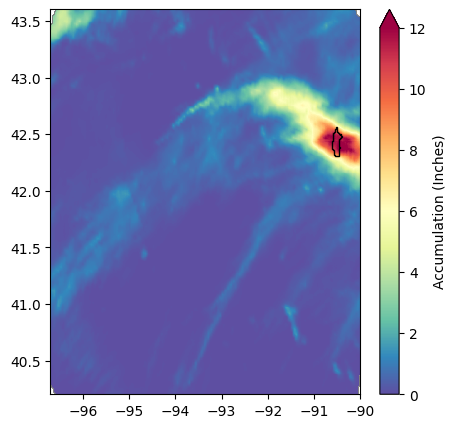
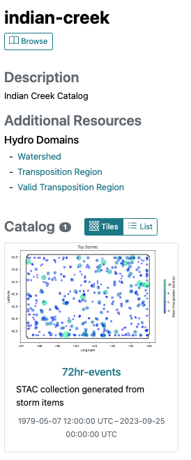
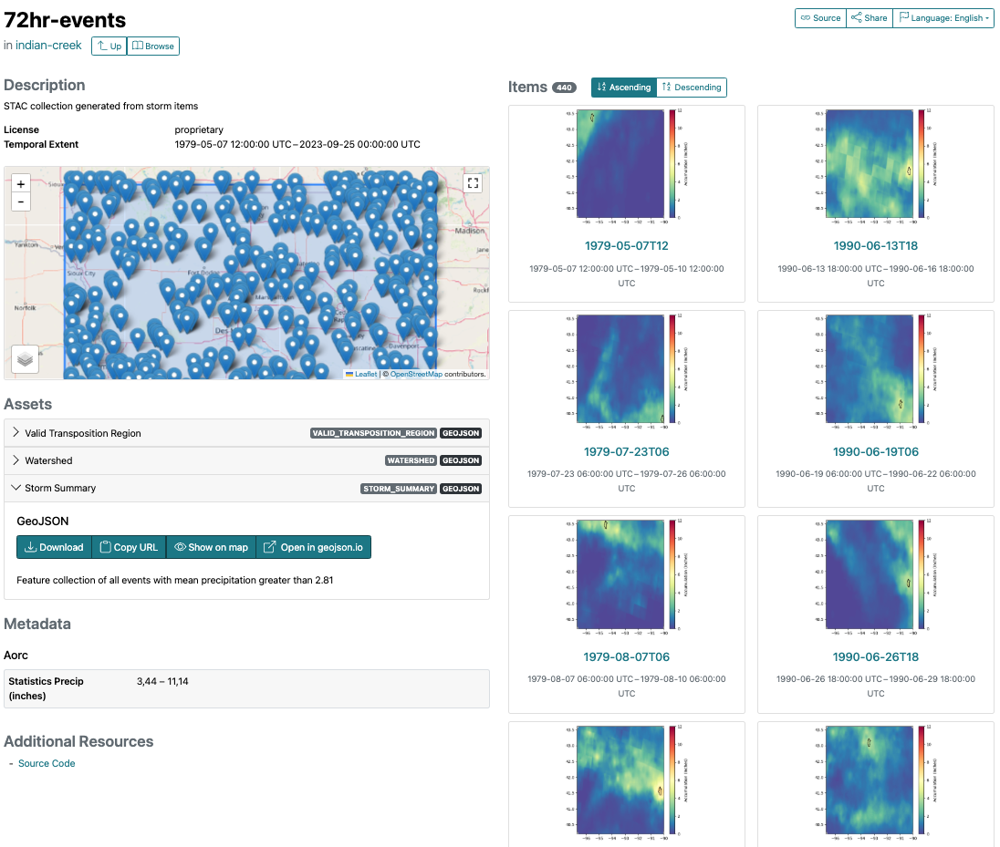
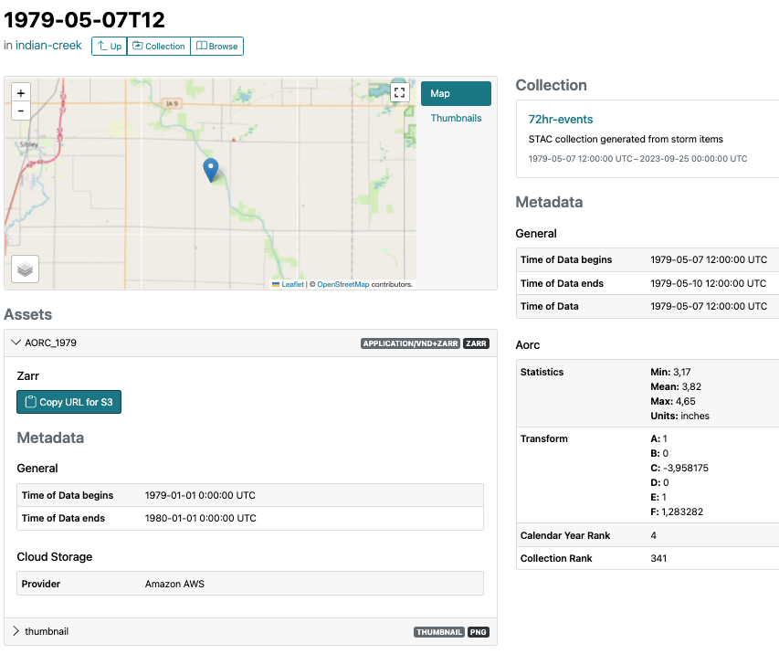

#################
Technical Summary
#################

==========================
Storm Transposition Module
==========================

Data Source
-----------
The Analysis Of Record for Calibration (AORC) dataset is available on the AWS `Registry of Open Data <https://registry.opendata.aws/noaa-nws-aorc/>`_, and provides the 
source data for precipitation and temperature data used in this module. (Other sources may be added but are not currently available). This gridded / houlry data is available for the CONUS 
beginning on 1972-02-01 and is updated regularly. 

The primary inputs used for the data development workflow are as follows.

    Watershed = The waterhsed which will be used for hydrologic modeling.

    Transposition Area = A region containing the watershed that has been developed as a hydro-meteorologically homogenous region.

    Storm Duration = The duration of a precipitation event of interest (e.g. 72 hours).

Workflow
--------

For creating a storms database, the following general steps are used (with the following options):

1. **Select a storm duration (hours) and start date**: Principal inputs for creating a storm collection.

    start_date = "1979-02-01" (This is the first available date for AORC data)

    storm_duration =  72 (A 3-day event)

    end_date = "1989-12-31" (Optional, will default to current datetime)

.. image:: ./images/sum-mask.png

2. **Identify the maximum precip data and location for a given start_date and duration**: This is performed by reading and masking data from the data source (i.e. AORC). Because the data is stored in zarr files, data can be
sliced and filtered to reduce the amount of IO required for computation and processing. Identification is performed using the transposition region as a mask, followed by summing up the hourly data to create a single matrix
of the cumulative sum (of precipitation) at each cell over the storm duration. The watershed is then moved from left to right, top to bottom over this masked grid, summing up and calculating the mean total in the overlapping
cells of the watershed within the transposition region. The centroid location and summary statistics of the watershedis then saved for that start_date and duration.

3. **Iterate over the period of record or desired date range**: In order to process multiple dates for a range (from start_date - end_date), there is an optional argumen `check_every_n_hours`. If set to 1, the process will sum up the storm duration for every hour from the start_date
to the end_date. For a 72-hour event, this would require processing 350,400 datasets (every hour for the period) for 40 years of record and would represent the most precise estimate to aid in identifying the start hour for the event. To save in processing
time and data, an alternate interval can be used. For example, selecting `check_every_n_hours` = 24 would result in 14,600 datasets processed for the same 40 year period.
    
    check_every_n_hours = 6 (This would get check the totals every 6 hours, or 4 times a day)

After processing the data for every date in the requested date range, a csv is created containing the results for the watershed at the location of highest cumulative mean within the transposition region:

+------------------------+------------+----------+----------+---------------------+-----------------+
| storm_date             | min        | mean     | max      |  x                  |    y            |
+========================+============+==========+==========+=====================+=================+
|1979-02-01T00           | 0.07       | 0.08     | 0.09     | -91.98900164708947  |42.70029858823525|
+------------------------+------------+----------+----------+---------------------+-----------------+
|1979-02-01T06           | 0.07       | 0.08     | 0.09     | -91.98900164708947  |42.70029858823525|
+------------------------+------------+----------+----------+---------------------+-----------------+
|1979-02-01T12           | 0.03       | 0.04     | 0.05     | -91.57235164708985  |42.70029858823525|
+------------------------+------------+----------+----------+---------------------+-----------------+
|1979-02-01T18           | 0.02       | 0.02     | 0.02     | -92.66397464708892  |40.50038658823523|
+------------------------+------------+----------+----------+---------------------+-----------------+

4. **Top events and date declustering** With the staticics in place, user settings can be used to create a STAC collection for the watershed / transpositon region / storm duration using the following inputs.
   
    min_precip_threshold = 2 (Defaults to 1, this can be used to filter out events based on a minimum threshold)
   
    top_n_events = 440 (This will be the total # of events in the collection. 440 would represent the top 10 events for 44 years)

To avoid double counting what is essentially the same storm because the N hour duration for several consecutive periods may result in a top storm, results of the query are iterated and added to a list,
a process filters storms to be skipped if there is any temporal overlap with a storm already existing in the list (the overlap is determined using the start time and duration of the top storm). As shown
in these images, these records are considered to be a single storm, and would be declustered, wherein the day with the greater mean precipitation would be included in the top storms collection and the other 
would be dropped.

.. figure:: ./images/2017062700.png

    *2017-06-28 (72 hours)*

.. figure:: ./images/2017062900.png

    *2017-06-29 (72 hours)*

5. The following additional arguments are available.
    
.. code:: bash

    specific_dates # Can be provided to resume processing in the event of a failure or other use cases

    with_tb # Defaults to false, if true this will return the full stack traceback for debugging

    create_new_items # Defaults to true, this will create a STAC item for each storm in the `top_n_events`

Results 
-------

A Storm Catalog is created containing a copy of the watershed, transposition domain, and the *valid transpositon domain* which is the space within the transposition domain wherein a 
watershed can be transposed without encountering null space (i.e. part of the watershed extending outside of the trnasposition domain).

STAC Collections will be added to the catalog for each storm duration requested. The collection will include relevant data including summary statistics, plots, and other assets to rpovide
context and metadata for the data.

The collection is compised of STAC Items, which provide links to source data and derivative products. For example, a model speciric timeseries file may be required for hydrologic modeling.
These files can be created and added to the event item alongside metadata and other information. Assets may include additional data required for modeling (i.e. temperature data, also available via AORC).  

2-yr Normalization
------------------

.. note::
   This feature was evaluated and used in pilot projects, does not currently exist in this repository, but may be incorporated in the future.

Where possible, `NOAA Atlas-14 precipitation frequency estimates <https://hdsc.nws.noaa.gov/hdsc/pfds/pfds_gis.html>`_ may be considered to normalize the average accumulation for each storm. 
.. image:: ./images/2yr03da.PNG
