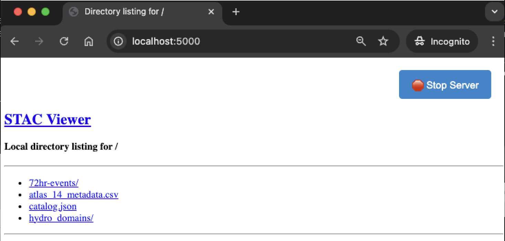
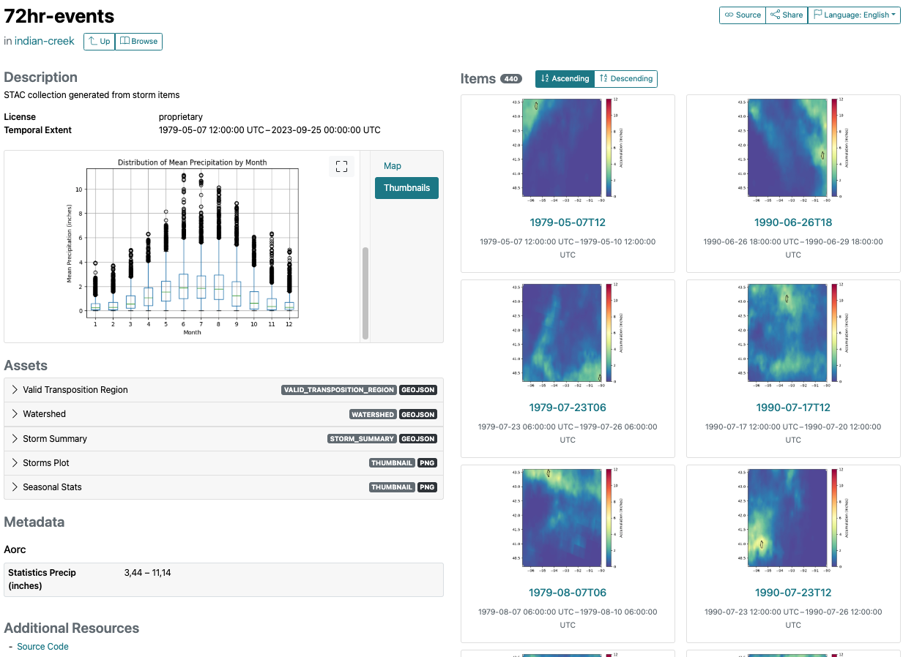

################
Getting Started
################

This section provides a high level overview for using stormhub for production, including starting the stormhub server and create objects.

Installation
------------

`stormhub` is registered with `PyPI <https://pypi.org/project/stormhub>`_
and can be installed simply using python's pip package installer. Assuming you
have Python already installed and setup:

   .. code-block:: bash

      pip install stormhub

Note that it is highly recommended to create a python `virtual environment
<https://docs.python.org/3/library/venv.html>`_ to install, test, and run
stormhub. 

Starting the server
-------------------

For convenience, a local file server is provided. This server is not necessary for data
production, but is useful for visualizing and exploring the data. 

**Start the stormhub file:**

   .. code-block:: bash

      stormhub-server <path-to-local-dir> 

Local file server is useful for interacting with STAC browser for viewing the data locally. This is not required....

   Figure: Images stored locally viewed through the browser using a local file server.

Workflows
---------

A config file shown in below includes the information required to create a new catalog.

.. code-block:: json

   {
      "watershed": {
         "id": "indian-creek",
         "geometry_file": "<LOCAL-OR-REMOTE-PATH>/watershed.geojson",
         "description": "Watershed for use in development of storm catalog"
      },
      "transposition_region": {
         "id": "indian-creek-transpo-area-v01",
         "geometry_file": "<LOCAL-OR-REMOTE-PATH>/transposition_region.geojson",
         "description": "Transposition Domain developed by the hydromet team"
      }
   }

The following snippet provides an example of how to build and create a storm catalog. Requires an example watershed and transposition domain (examples availble in the `repo <https://github.com/Dewberry/stormhub/tree/main/catalogs/example-input-data>`_).

.. code-block:: python

   from stormhub.logger import initialize_logger
   from stormhub.met.storm_catalog import new_catalog, new_collection

   if __name__ == "__main__":
      initialize_logger()

      # Catalog Args
      root_dir = "<local-path>"
      config_file = f"{root_dir}/duwamish/config.json"
      catalog_id = "duwamish"
      local_directory = f"{root_dir}"

      storm_catalog = new_catalog(
         catalog_id,
         config_file,
         local_directory=local_directory,
         catalog_description="Duwamish Catalog",
      )

      # All Collection Args
      start_date = "1979-02-01"
      end_date = "2024-12-31"
      top_n_events = 440

      # Collection Args
      storm_duration_hours = 48
      min_precip_threshold = 2.5
      storm_collection = new_collection(
         storm_catalog,
         start_date,
         end_date,
         storm_duration_hours,
         min_precip_threshold,
         top_n_events,
         check_every_n_hours=6,
      )

Viewing Results
----------------
Example Collection created for the indian-creek example data.

Collection Views

Troubleshooting
----------------

For help troubleshooting, please add an issue on github at `<https://github.com/Dewberry/stormhub/issues>`_